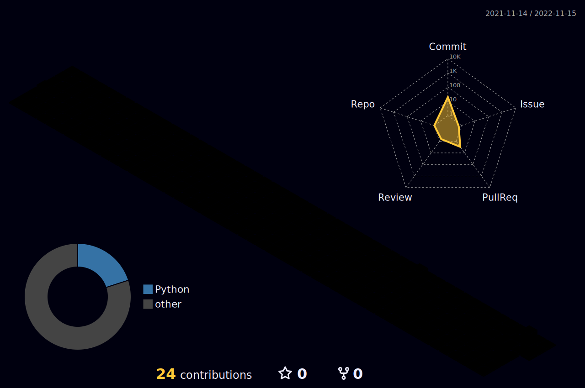

- 👋 Hi, I’m @Panzerjan
- 👀 I’m interested in Python, C#, TSQL, IaC, architecture etc
- 🌱 I’m currently learning IaC using Terraform, Python, Github Actions, bash and C#
- 🌱 I work as Data Enigneer

<!---
Panzerjan/Panzerjan is a ✨ special ✨ repository because its `README.md` (this file) appears on your GitHub profile.
You can click the Preview link to take a look at your changes.
--->

  <h1 align="center"><b>Hello there, I'm Jan Erik 👋</b></h1>

  <h4 align="center"><b>"Any fool can write code that a computer can understand ..."</b></h4>

### :zap: Github Stats

